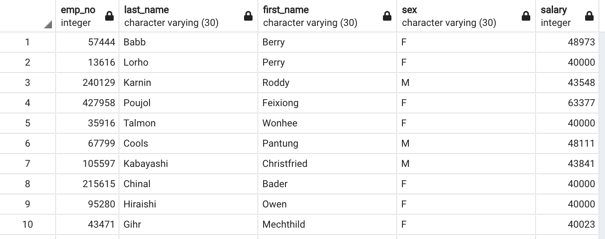
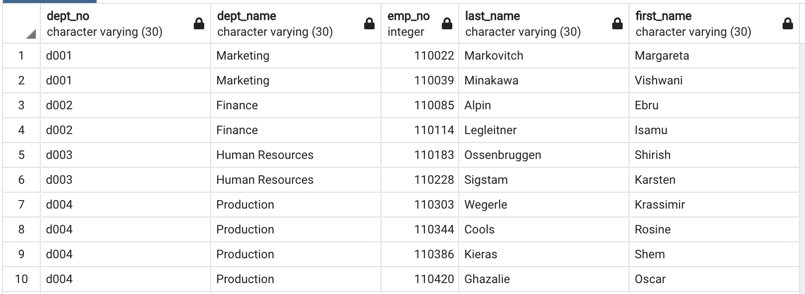
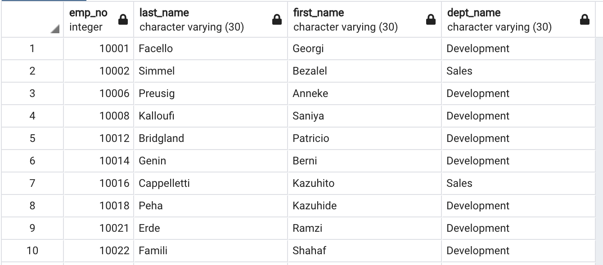

## Summary

We are given six CSV files that contain employee information from the 1980s to 1990s. These CSVs contain department, employee, manager, salary, and title information. The goal of this analysis is to find anything unique from the data from the given timeframe.

## Scope

Firstly, the CSV files were inspected and an ERD of the tables was sketched out. I create a table schema for each of the six CSV files and imported each file into their corresonding SQL table.

I scripted queries that will give me information useful for analysis. This includes:

 - List the following details of each employee: employee number, last name, first name, sex, and salary.

 

 - List first name, last name, and hire date for employees who were hired in 1986.
 - List the manager of each department with the following information: department number, department name, the manager's employee number, last name, first name.

 

- List the department of each employee with the following information: employee number, last name, first name, and department name.
 - List first name, last name, and sex for employees whose first name is "Hercules" and last names begin with "B."
 - List all employees in the Sales department, including their employee number, last name, first name, and department name.
 - List all employees in the Sales and Development departments, including their employee number, last name, first name, and department name.

 

- List of the frequency count of employee last names

Then I used sqlaclehmy to import create_engine to import the SQL database into Pandas. With this, I was able to create a few visualizations from the tables created from the original datasets. These visualizations can be found in the Jupyter Notebook.
